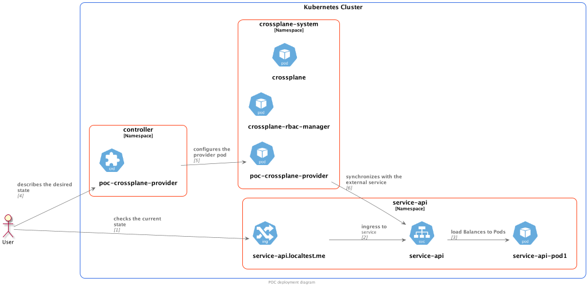

# POC Crossplane

This POC is a simple scenario with a REST api and a crossplane that call this API to synchronize the state defined in 
the CRDs (desired state) with the real state in the external service (real state). 

* service-api: REST api all the operations related to a certain entity (topic)
* poc-crossplane-provider: a crossplane provider that synchronizes the state defined
 by CRDs to the external service (service-api).

You can find more information about Crossplane [here](https://crossplane.io/docs/v1.8/)



## Prerequisites

* [Install K8S local cluster with KinD](doc/01_K8S_LOCAL_CLUSTER_KIND.md)
* [Install Crossplane](doc/02_INSTALL_CROSSPLANE.md)

## Service API

The service API is written in Kotlin. For the sake of simplicity the persistence is in memory
and no security is in place. Of course in a real scenario those aspects should be improved.

Find here the instructions to deploy it -> [Deploy Service API](doc/03_DEPLOY_SERVICE_API.md)

## Crossplane provider

Crossplane provider has been based on the [provider-template](https://github.com/crossplane/provider-template). Although I 
usually prefer a single repo per POC, in this case the code for the controller is in a separate repository: 
[poc-crossplane-provider](https://github.com/scalvetr/poc-crossplane-provider). That's because the provider-template offers a set 
of build scripts that relies on a rigid folder structure.

This provider has been writen in golang and uses a library [service-client](./service-client) for the communication
with service-api. This library is packaged along with the provider.

Find here the instrucations to [deploy the crossplane provider](doc/04_DEPLOY_PROVIDER.md)

## Deploy example

First we create a `ProviderConfig` in this case we set up the following parameters:
* api_url: url of the service. As the provider and the service are deployed in the same cluster, we'll use the internal url.
* tenant: it is a header that will be sent to the service
* credentials: credentials from the API. For now they are not used.

```shell
cat <<EOF | kubectl create -f -
apiVersion: v1
kind: Secret
metadata:
  namespace: crossplane-system
  name: example-provider-secret
type: Opaque
data:
  credentials: "c3VwZXItc2VjcmV0LXBhc3N3b3Jk"
---
apiVersion: poc.crossplane.io/v1alpha1
kind: ProviderConfig
metadata:
  name: tenant1
spec:
  api_url: "http://service-api.service-api:8080/v1"
  tenant: "tenant1"
  credentials:
    source: Secret
    secretRef:
      namespace: crossplane-system
      name: example-provider-secret
      key: credentials
EOF
```

Once configured one tenant, we can start creating topics
```shell
cat <<EOF | kubectl create -f -
apiVersion: objects.poc.crossplane.io/v1alpha1
kind: Topic
metadata:
  name: topic1
spec:
  forProvider:
    name: topic1
    partitions: 4
  providerConfigRef:
    name: tenant1
EOF

curl -k --header "x-tenant: tenant1" https://service-api.localtest.me/v1/topics
# [{"name":"topic1","partitions":5,"status":null}]
```
It can also be modified
```shell
cat <<EOF | kubectl apply -f -
apiVersion: objects.poc.crossplane.io/v1alpha1
kind: Topic
metadata:
  name: topic1
spec:
  forProvider:
    name: topic1
    partitions: 4
  providerConfigRef:
    name: tenant1
EOF
# topic.objects.poc.crossplane.io/topic1 configured

curl -k --header "x-tenant: tenant1" https://service-api.localtest.me/v1/topics/topic1
# {"name":"topic1","partitions":4,"status":null}
```

Other useful commands
```shell
# get the provider config
kubectl get providerconfig tenant1 -o yaml

# get desired status for topic1
kubectl get topic topic1 -o yaml

# get current status of topic1
curl -k --header "x-tenant: tenant1" https://service-api.localtest.me/v1/topics/topic1

# check service logs
kubectl -n service-api logs -l app=service-api 
```

https://service-api.localtest.me/actuator/swagger-ui.html
